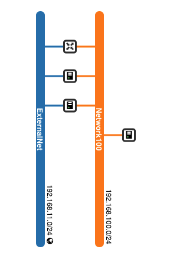
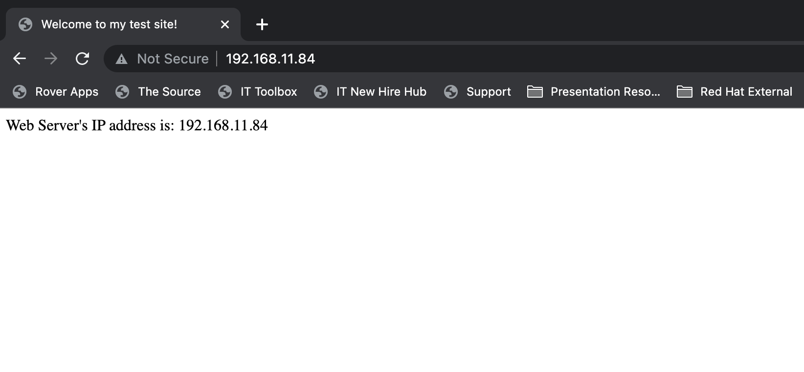

# Migrating Virtual Machines from OpenStack to OpenShift Virtualization


## Table of Contents

<!-- TOC -->
  - [Introduction](#introduction)
  - [Environment](#environment)
  - [Prerequisites](#prerequisites)
  - [Part 1 - Download the image of a running VM in OpenStack](#part-1---download-the-image-of-a-running-vm-in-openstack)
  - [Part 2 - Create Storage Mapping](#part-2---create-storage-mapping)
  - [Part 3 - Create Network Mapping](#part-3---create-network-mapping)
  - [Part 4 - Start the migrated VM in OpenShift Virtualization](#part-4---start-the-migrated-vm-in-openshift-virtualization)
<!-- TOC -->


## Introduction

[OpenShift Virtualization](https://docs.openshift.com/container-platform/4.8/virt/about-virt.html) is a feature of OpenShift that allows users to run and manage virtual machine workloads alongside container workloads on the same platform. It supports various virtualization tasks like creating new VMs, importing existing VMs from other platforms, managing network controllers and storage disks attached to VMs, etc.

A major attraction of OpenShift Virtualization was the feature to migrate existing VMs from other platforms like VMware vSphere and Red Hat Virtualization to OpenShift Virtualization using the [Migration Toolkit for Virtualization (MTV)](https://access.redhat.com/documentation/en-us/migration_toolkit_for_virtualization/2.2/html/installing_and_using_the_migration_toolkit_for_virtualization/about-mtv) operator. But MTV operator does not support the migration of VMs (instances) from Red Hat OpenStack platform at the moment. This post will go through the steps to cold migrate a VM from Red Hat OpenStack platform to OpenShift Virtualization.

## Environment

* [Red Hat OpenStack Platform 16.2 All-In-One Installation](https://github.com/rh-telco-tigers/OSP16.2-AIO)
* [Red Hat OpenShift Container Platform 4.10 Single Node Installation](https://docs.openshift.com/container-platform/4.10/installing/installing_sno/install-sno-installing-sno.html)
* JumpBox server to connect to OpenStack and OpenShift platforms 

The OpenStack environment has 2 networks that the VMs can connect to - an internal private network of type *Geneve* (Network100) and an external physical network of type *Flat* (ExternalNet).



Both these networks have to be mapped to equivalent networks in the OpenShift cluster. Hence, there are two network interfaces enabled on the worker node(s) of the OpenShift cluster. 
The OpenStack AIO host and the OpenShift cluster worker node(s) are on the same network subnet. 

## Prerequisites

* In the jumpbox, install -
 * [OpenStack command-line client](https://docs.openstack.org/newton/user-guide/common/cli-install-openstack-command-line-clients.html)
 * [OpenShift CLI](https://docs.openshift.com/container-platform/4.6/cli_reference/openshift_cli/getting-started-cli.html)

* Login to both OpenStack and OpenShift via the command-line from the jumpbox
* Install Container-native Virtualization (CNV) operator in the OpenShift cluster

## Part 1 - Download the image of a running VM in OpenStack 

For creating an image of a running VM (instance) in OpenStack, a new volume containing the VM's runtime ephemeral storage changes has to be created, which is then converted into an image that is downloaded. The detailed steps for the same using the OpenStack services *nova, cinder, and glance* are listed below - 

List VMs (instances) in OpenStack

```
# nova list
+--------------------------------------+--------------------+--------+------------+-------------+-------------------------------------------------------+
| ID                                   | Name               | Status | Task State | Power State | Networks                                              |
+--------------------------------------+--------------------+--------+------------+-------------+-------------------------------------------------------+
| 6f0113f1-afff-4bc4-a59e-768e4e1332a1 | CirrOSInstance1    | ACTIVE | -          | Running     | Network100=192.168.100.110, 192.168.11.64             |
| 9e4e2e44-b54d-4ae8-9490-ff225305fdb1 | FedoraServer1      | ACTIVE | -          | Running     | ExternalNet=192.168.11.84; Network100=192.168.100.102 |
| a478c7a7-15c5-4cdd-a536-3f9f6030c0e2 | Windows2012Server1 | ACTIVE | -          | Running     | ExternalNet=192.168.11.82; Network100=192.168.100.114 |
+--------------------------------------+--------------------+--------+------------+-------------+-------------------------------------------------------+
```

From the list, get the name of the VM you want to migrate. 

In this post, I will be migrating the VM 'FedoraServer1'. There is a simple website running on an httpd server on the VM that displays the server's IP address. 



The VM would have to be stopped in order to cold migrate it. 

```
# nova stop FedoraServer1
Request to stop server FedoraServer1 has been accepted.
```

Once the VM has been shut down, create a snapshot of the VM

```
# nova image-create --poll FedoraServer1 fedora_img_snap

Server snapshotting... 100% complete
Finished
```

Get the ID of the snapshot

```
# cinder snapshot-list
+--------------------------------------+--------------------------------------+-----------+------------------------------+------+----------------------------------+
| ID                                   | Volume ID                            | Status    | Name                         | Size | User ID                          |
+--------------------------------------+--------------------------------------+-----------+------------------------------+------+----------------------------------+
| f9db22c5-a490-438b-b1d9-a1ca7701d733 | e321fdb8-ba6a-4b07-97ea-86119b5b35ad | available | snapshot for fedora_img_snap | 15   | f8110b3150c84857b0ddf756afd0b137 |
+--------------------------------------+--------------------------------------+-----------+------------------------------+------+----------------------------------+
```

Create a volume from the snapshot by mentioning the snapshot ID and required size

```
# cinder create --snapshot-id f9db22c5-a490-438b-b1d9-a1ca7701d733 15
+--------------------------------+---------------------------------------+
| Property                       | Value                                 |
+--------------------------------+---------------------------------------+
| attachments                    | []                                    |
| availability_zone              | nova                                  |
| bootable                       | true                                  |
| consistencygroup_id            | None                                  |
| created_at                     | 2022-07-28T19:59:20.000000            |
| description                    | None                                  |
| encrypted                      | False                                 |
| group_id                       | None                                  |
| id                             | ae640e30-e2ad-4513-bd69-35946647b98a  |
| metadata                       | {}                                    |
| migration_status               | None                                  |
| multiattach                    | False                                 |
| name                           | None                                  |
| os-vol-host-attr:host          | hostgroup@tripleo_iscsi#tripleo_iscsi |
| os-vol-mig-status-attr:migstat | None                                  |
| os-vol-mig-status-attr:name_id | None                                  |
| os-vol-tenant-attr:tenant_id   | 51238d9ffcd9416da13ff40dd6086292      |
| provider_id                    | None                                  |
| replication_status             | None                                  |
| service_uuid                   | None                                  |
| shared_targets                 | True                                  |
| size                           | 15                                    |
| snapshot_id                    | f9db22c5-a490-438b-b1d9-a1ca7701d733  |
| source_volid                   | None                                  |
| status                         | creating                              |
| updated_at                     | 2022-07-28T19:59:21.000000            |
| user_id                        | f8110b3150c84857b0ddf756afd0b137      |
| volume_type                    | tripleo                               |
+--------------------------------+---------------------------------------+
```

Wait until the volume is created 

```
# openstack volume list
+--------------------------------------+------+-----------+------+---------------------------------------------+
| ID                                   | Name | Status    | Size | Attached to                                 |
+--------------------------------------+------+-----------+------+---------------------------------------------+
| ae640e30-e2ad-4513-bd69-35946647b98a | None | available |   15 |                                             |
| 7313a2d2-988c-4bb2-9799-f5b63582c70e |      | in-use    |   25 | Attached to Windows2012Server1 on /dev/vda  |
| e321fdb8-ba6a-4b07-97ea-86119b5b35ad |      | in-use    |   15 | Attached to FedoraServer1 on /dev/vda       |
| b4f6de2c-19bf-4b15-8e64-8e4da15e8417 |      | in-use    |   10 | Attached to CirrOSInstance1 on /dev/vda     |
+--------------------------------------+------+-----------+------+---------------------------------------------+
```

Using the volume ID, attach the newly created volume to an image that can be downloaded

```
# cinder upload-to-image ae640e30-e2ad-4513-bd69-35946647b98a fedora_img_download
+---------------------+--------------------------------------+
| Property            | Value                                |
+---------------------+--------------------------------------+
| container_format    | bare                                 |
| disk_format         | raw                                  |
| display_description | None                                 |
| id                  | ae640e30-e2ad-4513-bd69-35946647b98a |
| image_id            | 0e953af4-093d-4dfc-a24d-a4959e7e816a |
| image_name          | fedora_img_download                  |
| protected           | False                                |
| size                | 15                                   |
| status              | uploading                            |
| updated_at          | 2022-07-28T19:59:21.000000           |
| visibility          | private                              |
| volume_type         | tripleo                              |
+---------------------+--------------------------------------+
```

Wait until the image is created and is in active state. You can check the status this way using the image name

```
# openstack image show fedora_img_download
+------------------+--------------------------------------------------------------------------------------------------------+
| Field            | Value                                                                                                  |
+------------------+--------------------------------------------------------------------------------------------------------+
| container_format | bare                                                                                                   |
| created_at       | 2022-07-28T20:03:19Z                                                                                   |
| disk_format      | raw                                                                                                    |
| file             | /v2/images/0e953af4-093d-4dfc-a24d-a4959e7e816a/file                                                   |
| id               | 0e953af4-093d-4dfc-a24d-a4959e7e816a                                                                   |
| min_disk         | 0                                                                                                      |
| min_ram          | 0                                                                                                      |
| name             | fedora_img_download                                                                                    |
| owner            | 51238d9ffcd9416da13ff40dd6086292                                                                       |
| properties       | architecture='x86_64', description='Fedora Cloud Image', os_hidden='False', signature_verified='False' |
| protected        | False                                                                                                  |
| schema           | /v2/schemas/image                                                                                      |
| status           | saving                                                                                                 |
| tags             |                                                                                                        |
| updated_at       | 2022-07-28T20:03:20Z                                                                                   |
| visibility       | private                                                                                                |
+------------------+--------------------------------------------------------------------------------------------------------+
.
.
.
.
# openstack image show fedora_img_download
+------------------+-----------------------------------------------------------------------------------------------------------------------------------------------------------------------------------------------------------------------------------------------------------------------------------------------------------------------------------------------------------------------------------------+
| Field            | Value                                                                                                                                                                                                                                                                                                                                                                                   |
+------------------+-----------------------------------------------------------------------------------------------------------------------------------------------------------------------------------------------------------------------------------------------------------------------------------------------------------------------------------------------------------------------------------------+
| checksum         | d46e68bad1a32825234d6faed3baeff3                                                                                                                                                                                                                                                                                                                                                        |
| container_format | bare                                                                                                                                                                                                                                                                                                                                                                                    |
| created_at       | 2022-07-28T20:07:23Z                                                                                                                                                                                                                                                                                                                                                                    |
| disk_format      | raw                                                                                                                                                                                                                                                                                                                                                                                     |
| file             | /v2/images/070e9766-7a78-47dc-a02d-70531496624a/file                                                                                                                                                                                                                                                                                                                                    |
| id               | 070e9766-7a78-47dc-a02d-70531496624a                                                                                                                                                                                                                                                                                                                                                    |
| min_disk         | 0                                                                                                                                                                                                                                                                                                                                                                                       |
| min_ram          | 0                                                                                                                                                                                                                                                                                                                                                                                       |
| name             | fedora_img_download                                                                                                                                                                                                                                                                                                                                                                     |
| owner            | 51238d9ffcd9416da13ff40dd6086292                                                                                                                                                                                                                                                                                                                                                        |
| properties       | architecture='x86_64', description='Fedora Cloud Image', direct_url='swift+config://ref1/glance/070e9766-7a78-47dc-a02d-70531496624a', os_hash_algo='sha512', os_hash_value='8748e7fed4550c813c8159b00ce529d374157f680d85a8041c1ae2434d8bd05e538ea086afd741e56831b26565fd52f2c104fda50bf9647a3ad52bd24722e609', os_hidden='False', signature_verified='False', stores='default_backend' |
| protected        | False                                                                                                                                                                                                                                                                                                                                                                                   |
| schema           | /v2/schemas/image                                                                                                                                                                                                                                                                                                                                                                       |
| size             | 16106127360                                                                                                                                                                                                                                                                                                                                                                             |
| status           | active                                                                                                                                                                                                                                                                                                                                                                                  |
| tags             |                                                                                                                                                                                                                                                                                                                                                                                         |
| updated_at       | 2022-07-28T20:09:56Z                                                                                                                                                                                                                                                                                                                                                                    |
| visibility       | private                                                                                                                                                                                                                                                                                                                                                                                 |
+------------------+-----------------------------------------------------------------------------------------------------------------------------------------------------------------------------------------------------------------------------------------------------------------------------------------------------------------------------------------------------------------------------------------+
```

Download the volume image created using the image ID

```
# glance image-download --file fedora_img_download.raw 070e9766-7a78-47dc-a02d-70531496624a
```

Convert the image from raw format to qcow2 format using [QEMU disk image utility](https://www.qemu.org/download/#linux)

```
# qemu-img convert -f raw -O qcow2 fedora_img_download.raw fedora_img_download.qcow2
```

The QEMU disk image utility can be used to get the expected virtual size of the image

```
# qemu-img info fedora_img_download.qcow2 
image: fedora_img_download.qcow2
file format: qcow2
virtual size: 15 GiB (16106127360 bytes)
disk size: 1.96 GiB
cluster_size: 65536
Format specific information:
    compat: 1.1
    compression type: zlib
    lazy refcounts: false
    refcount bits: 16
    corrupt: false
    extended l2: false
```

While migrating a VM from a source to destination host, VM's storage and network configurations have to be created at the destination host, which are equivalent to the ones the VM had in the source host. Now that the VM's image has been downloaded from the source host, equivalent storage mapping can be created.

## Part 2 - Create Storage Mapping

In case of OpenStack to OpenShift VM migration, equivalent storage configuration for the VM is created in the OpenShift cluster by creating a PVC with the required image size for the VM to bind to.

OpenShift Virtualization uses [Containerized Data Importer (CDI)](https://docs.openshift.com/container-platform/4.7/virt/virtual_machines/virtual_disks/virt-uploading-local-disk-images-virtctl.html) to import a VM image into a persistent volume claim (PVC) by using a data volume.

Create a *DataVolume* object with *upload* data source to use for uploading the local VM image

```
cat << EOF | oc create -f -
apiVersion: cdi.kubevirt.io/v1beta1
kind: DataVolume
metadata:
  annotations:
    cdi.kubevirt.io/storage.bind.immediate.requested: "true"
    kubevirt.ui/provider: local-provider
  name: fedora-dv
  namespace: migration
spec:
  pvc:
    accessModes:
      - ReadWriteOnce
    resources:
      requests:
        storage: 15Gi 
    storageClassName: lvstore
    volumeMode: Filesystem
  source:
    upload: {}
EOF
```

Make sure to change the ```specs```attributes as per the underlying persistent storage setup of your OpenShift cluster. In this post, the OpenShift cluster has been setup on a single node that uses local volumes for persistent storage. Also change the ```name``` and ```namespace``` attribute as required. 

While uploading images using CDI, its SSL certificates must be trusted by the browser. If a trusted CA is used for the OpenShift cluster certificates, this will be sufficient. If not, the cdi-uploadproxy-openshift-cnv application has to be browsed under the OpenShift cluster's ingress URL to accept its SSL certificate. Any 404 errors may be ignored during this process. The URL can be obtained using the following command

```
oc whoami --show-console | sed 's/console-openshift-console/cdi-uploadproxy-openshift-cnv/'
```

The qcow2 image can be uploaded from jumpbox's local storage to OpenShift Virtualization using the [virtctl client](https://docs.openshift.com/container-platform/4.8/virt/install/virt-installing-virtctl.html) that specifies the parameters defined above

```
# virtctl image-upload dv fedora-dv --size=15Gi --image-path=/root/fedora_img_download.qcow2  --insecure
Using existing PVC migration/fedora-dv
Uploading data to https://cdi-uploadproxy-openshift-cnv.apps.ocpd.example.com

 1.96 GiB / 1.96 GiB [=========================================================================================================================================================================] 100.00% 23s

Uploading data completed successfully, waiting for processing to complete, you can hit ctrl-c without interrupting the progress
Processing completed successfully
Uploading /root/fedora_img_download.qcow2 completed successfully
```

Wait until the upload is completed. Ensure that the datavolume upload succeeded and the PVC was created successfully 

```
# oc get dv -n migration
NAME        PHASE       PROGRESS   RESTARTS   AGE
fedora-dv   Succeeded   N/A                   2m26s
```

```
oc get pvc -n migration
NAME        STATUS   VOLUME              CAPACITY   ACCESS MODES   STORAGECLASS   AGE
fedora-dv   Bound    local-pv-64fe52ca   372Gi      RWO            lvstore        3m28s
```

With this the required storage mapping for the VM is created. Now the network mapping can be created.

## Part 3 - Create Network Mapping


As the OpenStack environment had two networks in it, the two network interfaces enabled on the worker node(s) of the OpenShift cluster will be used for creating a network mapping. One thing to be noted in case of network mapping is that the network configurations of the VM like IP address, MAC addresses, etc. are preserved during migration. 

The *Network100* private network in OpenStack can be mapped in 2 ways - 
* It can be mapped to the default pod network of OpenShift cluster, in which case the IP address of the VM associated with this network will change as the CIDR ranges are different for the *Network100* private network and pod network. If the internal communication between VMs connected through this network are IP address independent, this mapping can be used. 
* It can be mapped to a new internal network by creating a bridge interface that is attached to a third network interface on the OpenShift worker node(s). The *Network100* private network IP addresses of the VM can be retained in this case.


The *ExternalNet* external network in OpenStack can be mapped to an equivalent network configuration in the following way

Create a bridge interface which attaches to the second network interface enabled on the OpenShift cluster worker node(s) by creating a *Node Network Configuration Policy*

```
cat << EOF | oc create -f -
apiVersion: nmstate.io/v1
kind: NodeNetworkConfigurationPolicy
metadata:
  name: eno2-br-nncp
spec:
  nodeSelector:
    node-role.kubernetes.io/worker: ""
  desiredState:
    interfaces:
      - name: br1
        description: Linux bridge with eno2 as a port
        type: linux-bridge
        state: up
        ipv4:
          enabled: false
          dhcp: false
        bridge:
          options:
            stp:
              enabled: false
          port:
            - name: eno2
EOF
```

Change the name of the second network interface if its not *eno2*.

The VMs in a specific namespace in the OpenShift Virtualization cluster can connect to additional networks using a custom resource that exposes layer-2 devices called *Network Attachment Definition* 

```
cat << EOF | oc apply -f -
apiVersion: "k8s.cni.cncf.io/v1"
kind: NetworkAttachmentDefinition
metadata:
  name: tuning-bridge
  namespace: migration
  annotations:
    k8s.v1.cni.cncf.io/resourceName: bridge.network.kubevirt.io/br1
spec:
  config: '{
    "cniVersion": "0.3.1",
    "name": "tuning-bridge",
    "plugins": [
      {
        "type": "cnv-bridge",
        "bridge": "br1"
      },
      {
        "type": "tuning"
      }
    ]
  }'
EOF
```


**TODO : EDIT TO MAKE IT CLEARER - As the OpenStack AIO host and the OpenShift cluster worker node(s) are on the same network subnet, the interface connected to *ExternalNet* external network and the secondary interface the bridge interface connects to are on the same subnet. Hence the VM's *ExternalNet*
network IP address in OpenStack can be retained in OpenShift Virtualization as well.** 

With this the required network configuration mapping for the VM is created. Now the migrated VM can be started by associating it with the created storage and network mappings.

## Part 4 - Start the migrated VM in OpenShift Virtualization

MAC address static via interface and ip static address via cloud-init